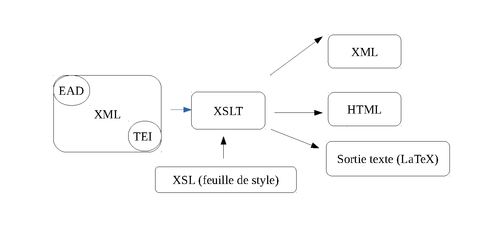
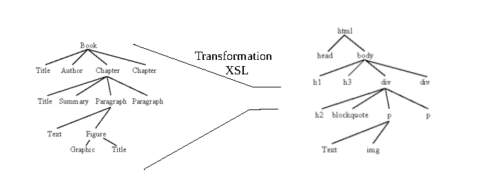
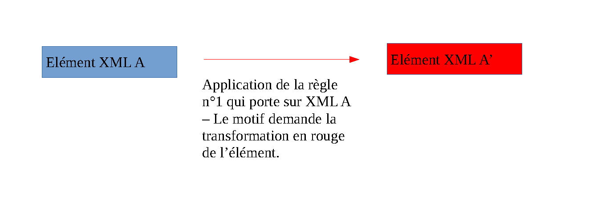

 séance 1 

# Définitions et premières transformations

---
## L'environnement XML 

---

## Définition

« XSLT (extensible Stylesheet Language Transformations) est un langage de programmation fonctionnel utilisé pour spécifier comment un document XML est transformé en un autre document qui peut, mais qui n’est pas nécessairement, un autre document XML. Un processeur XSLT lit un arbre XML en entrée et une feuille de style XSL et produit un arbre résultat en sortie. »

Elliotte Rusty Harold, W. Scott Means, Philippe Ensarguet [et al.], *XML en concentré*, Paris, O’Reilly, 2005, p. 519.

---

---

---

## Principes généraux de fonctionnement 

« Par défaut, un processeur XSLT lit le document XML d’entrée de haut en bas, commençant à l’élément racine et descendant dans l’arborescence en suivant l’ordre d’apparition des éléments. Les règles modèles sont activées dans l’ordre de rencontre des éléments. Ceci signifie qu’une règle modèle pour un élément sera activée avant les règles modèles correspondant à ses sous-éléments. »

Elliotte Rusty Harold, W. Scott Means, Philippe Ensarguet [et al.], *XML en concentré*, Paris, O’Reilly, 2005, p. 164.

---

## Observer

Dans Oxygen :

1) Appliquer une XSLT vide sur le document Mon_reve_familierTEI.xml

2) Appliquer la règle suivante :
`<xsl:template match="/">`
        `<xsl:apply-templates/>`
`</xsl:template>`

3) Appliquer la règle suivante :
`<xsl:template match="text()"/>`

---
## Sélectionnner des éléments XML

1) Comment sélectionner et copier l'élément `<lg>` ?;
2) Sélectionner et copier uniquement les `<lg>`dont la valeur de @type est "quatrain";
3) Sélectionner et copier tous les troisièmes vers;
4) Sélectionner et copier le troisième `<l>` du deuxième tercet;
5) Copier les `<lg>` qui sont premiers dans l’arbre;
6) Copier les `<lg>` qui sont moins que deuxième dans l’arbre;
7) Copier les `<lg>` qui sont plus que deuxième dans l’arbre.

---
**Pour les plus aguerris** : sélectionner uniquement le troisième vers du poème sans passer par `<lg>[1]`.