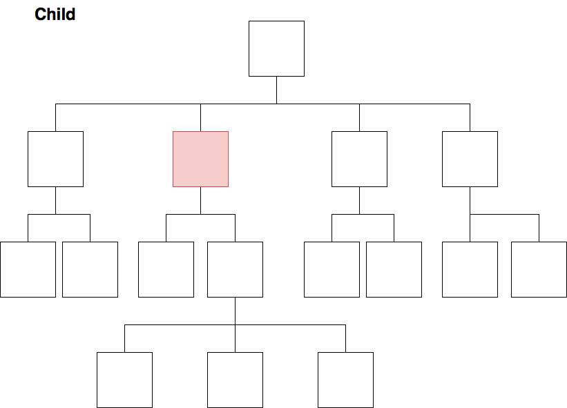

 séance 1 

# Définitions et premières transformations

---
## L'environnement XML 


---

# Environnement XML et révisions Xpath

---
## Parser, transformer, interroger son XML : Xpath - XSLT - Xquery

- Xpath est un langage pour parser/naviguer dans les documents XML :
```Xpath 
       TEI/text/body/lg/l 
```
-  XSLT est un langage de transformation pour les documents XML 

```XSL
<xsl:template match="TEI/text/body/lg/l">
   <xsl:element name="l">
        <xsl:value-of select="."/>
    </xsl:element>
</xsl:template>
```
---

- Xquery est un langage pour interroger les documents XML qui forment alors une sorte de base de données.
```Xquery
for $x in doc("books.xml")/bookstore/book
where $x/price>30
order by $x/title
return $x/title
```

---
## Rappels Xpath : définition et syntaxe 


### Définition

* Xpath 2.0 est publié par le *World Wide Web Consortium* (W3C) et s’inscrit dans la famille des standards XML;

* Xpath est un langage de requêtes qui permet de parcourir un arbre XML;

* Xpath a été conçu comme un langage intégré, et non pas un langage autonome; 
	
* **Attention** : Xpath est un « read-only » langage. 

<br/>

Pour aller plus loin : Michael R. Kay, *XPath 2.0 programmer’s reference*, Indianapolis, IN, Wrox Press, 2004. p.1-5.

---

### La syntaxe Xpath
<br/>
<br/>
Une expression de chemin correspond à une séquence d’étapes séparées par l’opérateur « / ». 
Sans indication particulière la relation se fait d’un élément parent vers un élément enfant.
<br/>
<br/>
Pour en savoir plus :<br/>
Michael R. Kay, XPath 2.0 programmer’s reference, Indianapolis, IN, Wrox Press, 2004, p.215-216. 

---

#### Exercice de repérage (1)

* Mon rêve familier 
	* Donner le chemin de la racine TEI vers les vers d’un quatrain
	* Donner le chemin de la racine TEI vers le titre
---

Xpath possède plusieurs axes de relation :

* ancestor : `ancestor::node()`
* ancestor-or-self : `ancestor-or-self::node()`
* parent : `parent::node()`
* descendant : `descendant::node()`
* descendant-or-self : `descendant-or-self::node()`
* child : `child::node()` ou `node()`
* following : `following::element`
* following-sibling  : `following-sibling::node()`
* preceding :`preceding::node()`
* preceding-sibling : `preceding-sibling::node()`
* self : `self::node()` ou `.`
* attribute : `attribute::node()`
---


---



---

#### Exercice de repérage (2)

* Mon rêve familier 
	* Donner le chemin le plus court de la racine TEI vers les vers d’un quatrain

---

Pour affiner sa requête Xpath, on peut ajouter des **prédicats**. 
Le prédicat est noté entre crochets droits après l'élément auquel il se rapporte. 
On peut ainsi spécifier la position d'un élément, une relation d'un élément avec un autre élément, le nom ou la valeur de l'un de ses attributs.

Exemples : 

* `lg[attribute::type='sizain']`;
* `lg[attribute::type='quatrain'][position()=1]` ou `lg[attribute::type='quatrain'][1]`;
* `lg[attribute::type='quatrain']/l[last()]`.

---

#### Exercice de repérage (3)

* Mon rêve familier 
	* Donner le chemin le plus rapide de la racine TEI vers le vers n°2 du premier quatrain;

---
#### Quelques abréviations

* descendant : `//`
* child : `node()`
* self :  `.`
* attribute : `@`

---
#### Exercice

* Mon rêve familier 
	* Donner le chemin le plus rapide de la racine TEI vers le vers n°2 du premier quatrain;

Pour aller plus loin : https://www.w3schools.com/xml/xpath_intro.asp 

---

## Définition


« XSLT (extensible Stylesheet Language Transformations) est un langage de programmation fonctionnel utilisé pour spécifier comment un document XML est transformé en un autre document qui peut, mais qui n’est pas nécessairement, un autre document XML. Un processeur XSLT lit un arbre XML en entrée et une feuille de style XSL et produit un arbre résultat en sortie. »

Elliotte Rusty Harold, W. Scott Means, Philippe Ensarguet [et al.], *XML en concentré*, Paris, O’Reilly, 2005, p. 519.

---


---


---

## Principes généraux de fonctionnement 

« Par défaut, un processeur XSLT lit le document XML d’entrée de haut en bas, commençant à l’élément racine et descendant dans l’arborescence en suivant l’ordre d’apparition des éléments. Les règles modèles sont activées dans l’ordre de rencontre des éléments. Ceci signifie qu’une règle modèle pour un élément sera activée avant les règles modèles correspondant à ses sous-éléments. »

Elliotte Rusty Harold, W. Scott Means, Philippe Ensarguet [et al.], *XML en concentré*, Paris, O’Reilly, 2005, p. 164.

---

## Observer

Dans Oxygen :

1) Ouvrir le fichier Mon_reve_familierTEI.xml et un nouveau fichier xsl

2) Appliquer une XSLT vide sur le document Mon_reve_familierTEI.xml

3) Appliquer la règle suivante :
```XML
<xsl:template match="/">
        <xsl:apply-templates/>
</xsl:template>
```

4) Appliquer la règle suivante :

```XML
`<xsl:template match="text()"/>`
```
---

5) Appliquer la règle suivante :
```XML
<xsl:template match="/">
  <xsl:copy-of select="."/>
<xsl:template/>
```

---
## Sélectionnner des éléments XML

1) Comment sélectionner et copier l'élément `<lg>` ?;
2) Sélectionner et copier uniquement les `<lg>`dont la valeur de @type est 'quatrain';
3) Sélectionner et copier tous les troisièmes vers;
4) Sélectionner et copier le troisième `<l>` du deuxième tercet;
5) Copier les `<lg>` qui sont premiers dans l’arbre;
6) Copier les `<lg>` qui sont moins que deuxième dans l’arbre;
7) Copier les `<lg>` qui sont plus que deuxième dans l’arbre.

---
**Pour les plus aguerris** : sélectionner uniquement le troisième vers du poème sans passer par `<lg>[1]`.
